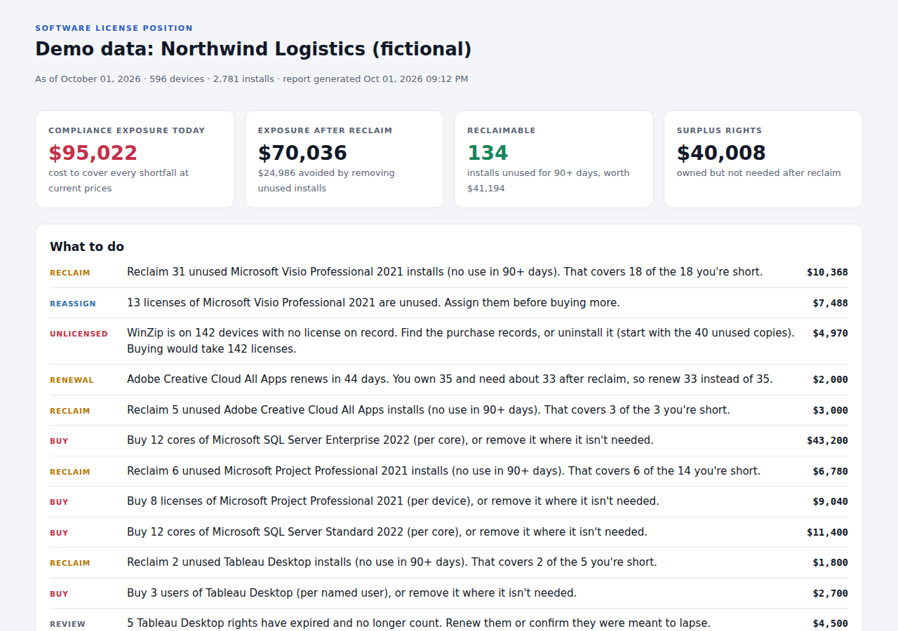

# SAM License Reconciler


A command-line tool that answers the questions every software asset manager gets before an audit or a renewal:

- **Are we compliant?** License position for every product: what you own against what you're using.
- **What would a true-up cost?** Dollar exposure per product, at your own purchase prices.
- **How much of that goes away if we clean up first?** Installs nobody has opened in 90 days, and what reclaiming them saves.
- **What are we paying for and not using?** Surplus rights to cut at renewal or reassign.

It reads from ServiceNow SAM Pro, or from CSV exports of any SAM or inventory tool (SCCM/MECM, Intune, Flexera, a spreadsheet). It never changes anything.



## Try it

Requires Python 3.10 or newer.

```bash
git clone https://github.com/YOUR-GITHUB-USERNAME/sam-license-reconciler.git
cd sam-license-reconciler
pip install -r requirements.txt

python -m sam_reconciler --demo --open
```

On Windows, use `py` in place of `python` if `python` isn't on your PATH.

The demo runs against a fictional 600-device company with 2,800 installs, built so each product shows a different situation:

```
  Compliance exposure today:        $95,022
  Exposure after reclaim:           $70,036
  Reclaimable installs:                 134   ($41,194)
  Surplus rights:                   $40,008

  Microsoft SQL Server Enterprise 2022   Shortfall              -12  ->    -12
  Microsoft Project Professional 2021    Shortfall              -14  ->     -8
  Microsoft Visio Professional 2021      Fixable by reclaim     -18  ->    +13
  WinZip                                 Unlicensed            -142  ->   -102
  ...
```

Demo prices are illustrative round numbers, not vendor quotes.

## How it works

**1. Normalize.** Discovery reports the same product under many names: `Microsoft Visio Professional 2021 (64-bit)`, `... - en-us`, `Visio Pro 2021`. Ordered regex rules map them to one product, with specific editions matched before general ones (AutoCAD LT before AutoCAD). Titles no rule matches are listed in the report so you can add rules for the commercial ones. When the data comes from SAM Pro, its normalized product is used as-is.

**2. Count what's consumed, per license metric.**

| Metric | What counts as one right | Example |
|---|---|---|
| Per device | Each device with the product (two copies on one device count once) | Visio, Project, Snagit |
| Per named user | Each person, across all their devices | Acrobat Pro, Creative Cloud, Tableau |
| Per core | Physical cores per server, after the core factor, the per-server minimum, and rounding up to 2-core packs | SQL Server, Windows Server, Oracle |
| Site / enterprise | Nothing; always covered | Zoom on a company-wide agreement |

So a 2-core VM running SQL Server Enterprise still needs 4 cores, a 24-core host running Windows Server Datacenter needs 24, and a 16-core Oracle server with a 0.5 core factor needs 8.

**3. Count what's owned.** Only entitlements active on the reconciliation date count. Expired rights are reported separately, since a lapsed renewal is an easy thing to miss. When entitlements were bought at different prices, the unit price is the weighted average.

**4. Find reclaimable installs.** A device install is reclaimable when it hasn't been used in 90 days (`--unused-days`). A named user is reclaimable only if they haven't used the product on *any* of their devices. Installs with no usage data are never treated as reclaimable; the report counts them instead, so the numbers stay defensible.

**5. Recommend actions.** The "What to do" list is ordered by priority and dollars: reclaim before buying, right-size renewals that fall within 90 days, cut surplus subscriptions at renewal, and reassign surplus perpetual licenses before buying more.

## Output

Each run writes four files to `reports/`:

| File | Use |
|---|---|
| `license_position.html` | The report above: headline numbers, action list, position by product, reclaim candidates, unrecognized titles. Self-contained, works in light and dark mode. |
| `license_position.csv` | One row per product with every number, for Excel or a renewal deck |
| `reclaim_candidates.csv` | Device, user and last-used date for each reclaimable install, ready to hand to the desktop team |
| `license_summary.json` | Totals and actions in machine-readable form, for trending or a dashboard |

See the [sample report](sample_report/license_position.html) generated from the demo data.

## Using your own data

### From CSV files

Put these files in a folder ([sample_data](sample_data) has a full example you can copy):

| File | Required columns | Optional columns |
|---|---|---|
| `devices.csv` | `device_id` | `name`, `kind`, `cores`, `assigned_user`, `department` |
| `installs.csv` | `device_id`, `display_name` | `install_id`, `publisher`, `version`, `last_used`, `product` |
| `entitlements.csv` | `product`, `rights` | `entitlement_id`, `metric`, `unit_cost`, `start_date`, `end_date`, `po_number` |
| `products.csv` | `name` | `publisher`, `metric`, `unit_price`, `free`, `core_factor`, `min_cores` |

Column names aren't case-sensitive, dates can be `YYYY-MM-DD` or `MM/DD/YYYY`, and metric names from other tools such as "Per Named User" or "Per Core (with CAL)" are understood.

```bash
python -m sam_reconciler --csv path/to/folder --open
```

### From ServiceNow SAM Pro

1. Copy `.env.example` to `.env` and fill in your instance and a read-only account. `.env` is git-ignored.
2. Run:

```bash
python -m sam_reconciler --live --open
```

By default it reads:

| Data | Table | Key fields |
|---|---|---|
| Installs | `cmdb_sam_sw_install` (only normalized, licensable installs) | `norm_product.name`, `installed_on` |
| Devices | `cmdb_ci_computer` (only devices that have installs) | `cpu_core_count`, `assigned_to.user_name` |
| Entitlements | `alm_license` | `software_model.product.name`, `rights`, `license_metric.name`, `cost`, `start_date`, `end_date` |

Instances differ between releases and customizations, so every table and field can be changed with `--mapping` (see [examples/mapping.example.json](examples/mapping.example.json)). Two things to check on your instance:

- **Usage data.** SAM Pro keeps usage in the Software Usage table (`samp_sw_usage`), not on the install record, so live mode doesn't pull last-used dates by default and reclaim will show 0. Map a field that holds them, or export usage and use CSV mode.
- **Cost.** By default `cost` on an entitlement is treated as the total paid and divided by `rights`. Set `"cost_is_total": false` if your `cost` field is already per right.

The client pages through results 1,000 rows at a time, retries when the instance throttles it (HTTP 429), and explains missing tables, missing roles and bad credentials in plain language.

### Options

```
--unused-days 60          reclaim threshold (default 90)
--expiring-days 120       renewal warning window (default 90)
--as-of 2026-12-31        reconcile as of a date, for example the audit date
--catalog products.csv    prices, metrics, core rules and freeware flags
--rules my_rules.json     extra normalization rules
--export-sample FOLDER    write the demo data as CSV files to use as a template
```

## Project layout

```
sam_reconciler/
  cli.py              command-line entry point
  normalize.py        display name -> product rules
  reconcile.py        consumption per metric, reclaim, exposure, surplus
  actions.py          the prioritized "what to do" list
  report.py           HTML, CSV and JSON output
  models.py           Device, Install, Entitlement, Product, Position
  sources/
    demo.py           repeatable sample company
    csv_source.py     CSV import and export
    servicenow.py     SAM Pro Table API client with configurable mapping
tests/                30 unit tests, no network needed
```

## Tests

```bash
python -m unittest discover -s tests -t .
```

The tests cover each license metric, core minimums and core factors, per-user reclaim across multiple devices, expired entitlements, weighted pricing, CSV parsing, the ServiceNow client against a fake HTTP session, and a CSV round trip that must produce exactly the same totals as the demo. GitHub Actions runs them on Windows and Linux for every push.

## Limits

This is a reconciliation aid, not a licensing authority. It doesn't model license mobility, virtualization rights (for example licensing a whole host versus individual VMs), CALs, downgrade rights, or contract-specific terms. Check those with the publisher's terms or your licensing partner before a true-up.

## Author

Built by Kester Atuanya, Senior ServiceNow Developer (CIS-SAM, CIS-ITSM, CIS-CAD, CSA).

## License

MIT
